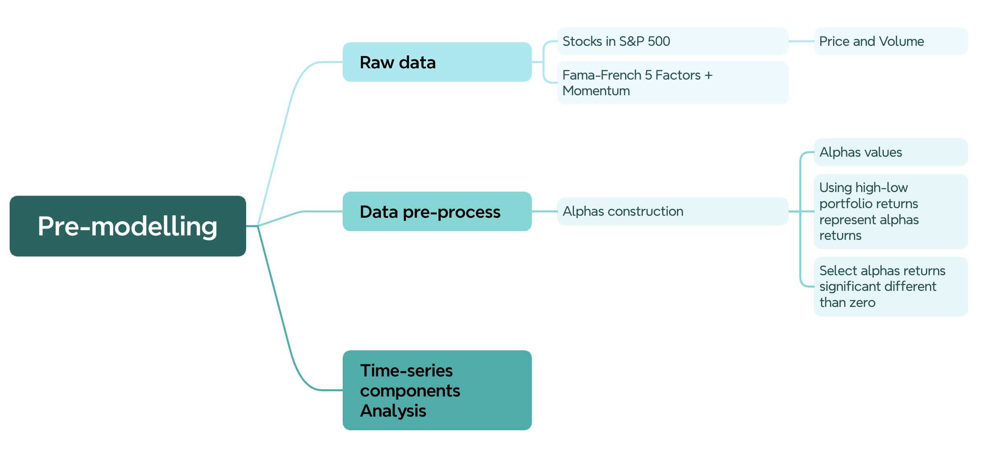
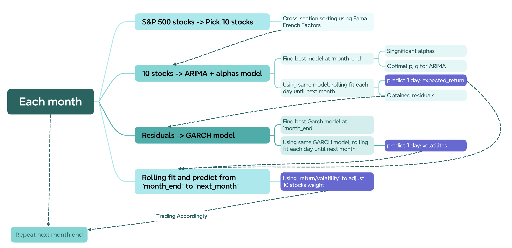
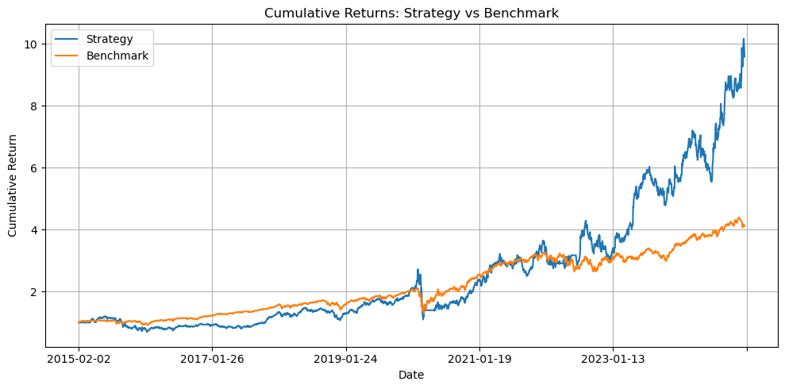
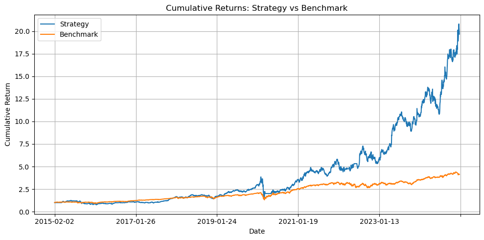

# FTS_project

Most factor models used in trading strategies are cross-sectional, meaning they rely on the relative ranking of stocks at a specific time. It is assumed that this ranking will remain stable over time and that the factors used for ranking will predict future returns. However, this assumption may not hold true under all market conditions, and the predictability of these factors can change over time, as can market anomalies. This can result in a model that overfits historical data and fails to generalize to new data.

In this project, we will explore a rolling window approach to address this issue, we will selected significant factors in the rolling window and combine them with time-series components to create a more robust model. Then we will build a trading strategy accordingly. The goal is to create a trading strategy that is more robust to changes in market conditions and can adapt to new data.

To achieve this, we selected Fama-French 5 factors plus momentum as the base factors. Then we constructed anomalies based on 101 Formulaic Alphas [Zura Kakushadze, 2015]. Finally, we used a rolling window approach to select the most significant factors, anomalies (alphas) and combined them with time-series components to create a more robust model.

In this project, we will:

- Pre-modelling
    - Provide an overview of the data used in our analysis. 
    - Analyze the time-series components of returns.
- Model construction
    - Discuss the trading strategy.
- Performance evaluation
    - Present the backtesting results.



101 Formulaic Alphas[Zura Kakushadze 2015] constructed 101 alphas using price and volume data. We will treat them as anomalies or features. The goal of this project is to implement the alphas and Fama-French 5 factors model as a base cross-sectional model, then develop a time-series model on residuals of each stock.

> Note: the 101 Formulaic Alphas paper stored in `docs/101_formulaic_alphas.pdf`.

## Model overview



## Python Environment setup

Using conda to create a virtual environment for the project.

```bash
conda create -n FTS python=3.12.7
conda activate FTS
```

Install dependencies

```bash
pip install -r requirements.txt
```

## File Structure

```plaintext
.
|-- docs/
|-- raw_data/               # Price and Volume for all stocks in SP500
|   |-- AAPL.csv
|   |-- ...
|-- notebooks/              # Some analysis usign jupyter nookbook
|   |-- backtest.ipynb
|   |-- ...
|-- src/                    # All src code reference in `main.py`
|   |-- time_series.py
|   |-- ...
|-- output/                 # All output files
|   |-- alphas/
|   |-- predictions/
|   |-- stock_returns.csv
|   |-- ...
|-- main.py                 # Main scripy
|-- requirements.txt        # Python dependencies
|-- README.md
|-- LICENSE
|-- .gitignore
```

## Run main script

Running `main.py` will generate all the files in `output/`

Note: The script will take a long time to run, as it will fit the model for each stock in the dataset. The script will also generate a lot of output files, so make sure you have enough disk space.

For quick testing, we comment out the steps, you can uncomment them to run the full script.

All Steps:
1. Calculate all alphas, stored in `output/alphas` folder. -> about 5 mins
2. Regroup alphas from ticker to alphas, each table -> about 5 mins -> For further analysis
3. Calculate z-scores for each stock, stored in `output/z_scores` folder. -> about 2 mins
4. Predict returns and volatility for each stock, stored in `output/predictions` folder. -> about 10 mins

Time may vary depending on the number of workers, size of data, and your machine.

## Backtesting

Backtesting is done using `notebooks/backtest.ipynb`. 

Backtesting result (with cost):



Backtesting result (without cost):



## Major Output

- `output/alphas/`: All alphas calculated from the raw data.
- `output/z_scores/`: Z-scores for each stock.
- `output/predictions/`: Predicted returns and volatility for each stock.
- `output/stock_returns.csv`: All stock returns.
- `output/significant_alphas_list.csv`: List of significant alphas.
