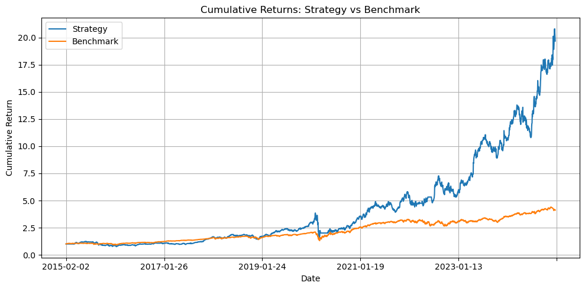

## Introduction

Most factor models used in trading strategies are cross-sectional, meaning they rely on the relative ranking of stocks at a specific time. It is assumed that this ranking will remain stable over time and that the factors used for ranking will predict future returns. However, this assumption may not hold true under all market conditions, and the predictability of these factors can change over time, as can market anomalies. This can result in a model that overfits historical data and fails to generalize to new data.

In this report, we will explore a rolling window approach to address this issue, we will selected significant factors in the rolling window and combine them with time-series components to create a more robust model. Then we will build a trading strategy accordingly. The goal is to create a trading strategy that is more robust to changes in market conditions and can adapt to new data.

To achieve this, we selected Fama-French 5 factors plus momentum as the base factors. Then we constructed anomalies based on 101 Formulaic Alphas [Zura Kakushadze, 2015]. Finally, we used a rolling window approach to select the most significant factors, anomalies (alphas) and combined them with time-series components to create a more robust model.

In this report, we will:

- Pre-modelling
    - Provide an overview of the data used in our analysis. 
    - Analyze the time-series components of returns.
- Model construction
    - Discuss the trading strategy.
- Performance evaluation
    - Present the backtesting results.

## Data Overview

We selected the following data for our analysis:

-  **Daily prices and volumes**: Daily prices and volumes for all stocks in the S&P 500 index.
-  **Fama-French 5 factors plus momentum**: mktrf, smb, hml, rmw, cma, umd.
-  **101 Formulaic Alphas**: We constructed these using daily prices and volumes.
-  **Daily returns for 101 Formulaic Alphas**: We generated daily returns for the 101 Formulaic Alphas using high-low arbitrage portfolios.

The data spans from January 1, 2004, to December 31, 2024, covering 20 years. We believe this is a sufficient amount of data to capture market dynamics across various conditions.

### Daily Prices and Volumes

The daily prices and volumes for all stocks in the S&P 500 index include:

-  **Close, Open, High, Low**: Adjusted close, open, high, and low prices.
-  **Vol**: Daily volume.
-  **Pct_change**: Daily percentage change. For example, -0.83 indicates a -0.83% daily return.
-  **VWAP**: Volume-weighted average price.

We will use this price data to construct the 101 Formulaic Alphas and conduct backtesting. Since we have a sufficient amount of data, we will not fill in any missing data. This approach utilizes a rolling window, which helps us avoid overfitting. For alpha construction, if a stock has missing data during the construction period, we will skip that stock.

### Fama-French 5 Factors plus Momentum

The Fama-French 5 factors plus momentum daily factors returns were obtained from WRDS(Wharton Research Data Services). The factors include:

- **mktrf**: Market return minus risk-free rate.
- **smb**: Small minus big (size factor).
- **hml**: High minus low (value factor).
- **rmw**: Robust minus weak (profitability factor).
- **cma**: Conservative minus aggressive (investment factor).
- **umd**: Up minus down (momentum factor).

### Alphas Construction

The 101 Formulaic Alphas paper [Zura Kakushadze, 2015] provides a comprehensive list of 101 real-life quantitative trading alphas. The original paper have a average holding period approximately ranges from 0.6 to 6.4 days. For our analysis, since we aim to construct a daily frequency trading strategy, we will hold the alphas for 1 day. However, the look back period for the alphas construction still varies based on the alphas construction method, details can be found in the paper. 

We calculated alphas for all stocks in the S&P 500. A sample of the alpha values is shown below, including the alpha value for **AAPL** from January 3, 2005, to January 6, 2005:

| trade_date | alpha001       | alpha002          | alpha003          |
|------------|----------------|-------------------|-------------------|
| 2005-01-03 | 0.359342330355 | -0.00060693612848 | -0.22883143600105 |
| 2005-01-04 | 0.204808971678 | -0.06933950066987 | 0.39975096612885  |
| 2005-01-05 | 0.065386808591 | 0.24332731404990  | 0.23698080798364  |
| 2005-01-06 | 0.817049990496 | 0.13108774439945  | 0.24530729110312  |

Then we sorted the alphas by their values on daily basis. Dividing the stocks into 5 groups, We used the arbitrage portfolio (long the top 20% and short the bottom 20%) to calculate the daily returns of each alpha. Sample of the daily returns for the alphas are calculated as follows:

| trade_date | alpha001  | alpha002  | alpha003  |
|------------|-----------|-----------|-----------|
| 2005-01-03 | -0.001604 | 0.004097  | 0.003343  |
| 2005-01-04 | -0.002053 | -0.001746 | 0.003168  |
| 2005-01-05 | 0.000321  | -0.001533 | -0.001220 |
| 2005-01-06 | -0.002266 | 0.003295  | -0.001950 |

#### Overall Significant Alphas Selection

In our backtesting period, 2004-2024, we first selected the alphas daily return is siginificantly different from 0. We used a t-test to determine the significance of the alphas. At the 5% significance level, 29 alphas were found to be significant. The t-test results are shown below:

| Alpha    | t-stat | Alpha    | t-stat | Alpha    | t-stat |
|----------|--------|----------|--------|----------|--------|
| alpha003 | -3.989 | alpha060 | -4.593 | alpha006 | -4.558 |
| alpha051 | -9.596 | alpha025 | -11.888| alpha020 | -5.886 |
| alpha049 | -10.508| alpha028 | -4.890 | alpha101 | 9.541  |
| alpha047 | -3.564 | alpha018 | -7.907 | alpha040 | -2.907 |
| alpha046 | -8.055 | alpha017 | -11.038| alpha005 | -2.740 |
| alpha042 | -5.334 | alpha014 | -13.343| alpha016 | -2.534 |
| alpha038 | -10.072| alpha013 | -4.074 | alpha053 | 2.530  |
| alpha035 | 4.996  | alpha012 | -4.152 | alpha008 | -2.374 |
| alpha034 | -12.283| alpha010 | -3.947 | alpha045 | 1.983  |
| alpha033 | -14.349| alpha009 | -5.562 |          |        |

The absolute correlation between the significant alphas daily returns is relatively low, the average absolute correlation is 0.15. The maximum absolute correlation is 0.71, which is between alpha009 and alpha010 (Due to their similar construction method). 

\newpage

## Time-Series Components Analysis

### Data Preparation for Time-Series Analysis

We started by reading multiple `.csv` files from the raw data folder.
Each file corresponds to a stock and contains columns such as
`trade_date`, `open`, `high`, `low`, `close`, `vol`, `pct_change`, and
`vwap`. The preprocessing included:

-   Parsing `trade_date` as datetime and setting it as the index.
-   Converting numerical columns to appropriate types and handling errors.
-   Sorting by date and filling missing values using forward and backward fill.
-   Computing daily returns using:

$$
\text{return}_t = \frac{\text{pct\_change}_t}{100}
$$

To mitigate the influence of extreme values, we clipped the returns at the 1st and 99th percentiles:

$$
r_t^{\text{clipped}} = 
\begin{cases}
q_{0.01}, & \text{if } r_t < q_{0.01} \\
r_t, & \text{if } q_{0.01} \leq r_t \leq q_{0.99} \\
q_{0.99}, & \text{if } r_t > q_{0.99}
\end{cases}
$$

After transformation, the new plot shows that all the returns are now clipped between -13% and 17%. This transformation reduces the impact of outliers and enhances the robustness of subsequent statistical analysis.

###  Time Series Analysis

In this section, we conduct a diagnostic analysis of the return series.

The primary tests are: 
- **Stationarity Tests**: To check if the return series are stationary. 
- **Ljung-Box Test**: To check for autocorrelation in the return series. 
- **ARCH LM Test** (Lagrange Multiplier Test):To check for ARCH effects, indicating volatility clustering.

### Stationarity Tests

#### **Unit Root Test**

To assess the stationarity of stock return series, we performed the Augmented Dickey-Fuller (ADF) and KPSS tests across all 496 stocks.

#### Augmented Dickey-Fuller (ADF) Test

-   Null hypothesis ( $H_0$ ): The series has a unit root (non-stationary)
-   If p-value < 0.05, we reject ( $H_0$ ), suggesting stationarity.

#### KPSS Test

-   Null hypothesis $H_0$: The series is stationary
-   If p-value > 0.05, we fail to reject $H_0$, suggesting stationarity.

#### Decision Rule

A series is considered stationary only if:

-   ADF test rejects $H_0$ (p < 0.05), and
-   KPSS test fails to reject $H_0$ (p > 0.05)

This dual-criteria approach ensures robustness in stationarity conclusions.

The following summarizes the statistical properties of the test results:

| Metric  | ADF Statistic | ADF p-value               | KPSS Statistic | KPSS p-value |
|---------|---------------|--------------------------|----------------|--------------|
| **Count** | 496           | 496                      | 496            | 496          |
| **Mean**  | -26.32        | $2.29 \times 10^{-10}$   | 0.116          | 0.097        |
| **Min**   | -77.92        | 0.0                      | 0.013          | 0.010        |
| **Max**   | -6.07         | $1.14 \times 10^{-7}$    | 1.012          | 0.100        |

#### Interpretation

-   The **ADF test** statistic has a strongly negative mean of -26.32 and nearly all p-values are effectively 0, indicating strong evidence to reject the null hypothesis of a unit root. This suggests the return series are stationary under the ADF test.

-   The **KPSS test** statistic has a mean of 0.116, with the maximum value slightly above 1. Most of the p-values are exactly 0.1 (the upper bound reported by the test), suggesting that the null hypothesis of stationarity is not rejected in most cases.

-  About 96.8% of the return series are confirmed to be stationary. These results confirm that the majority of stock return series in our dataset can be treated as stationary, validating their suitability for further time series modeling and statistical analysis.

\newpage

### Seasonal Decomposition

Our tests show that there is no seasonality and trend in stock return rates. Therefore, we do not consider seasonal decomposition in our models.

### Autocorrelation and ARCH Effect Detection

The Ljung-Box test checks the null hypothesis:

$$
H_0: \text{The series is white noise (no autocorrelation up to lag k).}
$$

The test statistic accumulates the squared autocorrelation coefficients up to lag ( k ). A significant p-value (typically p < 0.05) suggests that the series exhibits autocorrelation.

Since we conduct GARCH model on the residuals of the ARIMAX model, we should also check if there is ARCH effect in the residuals. We simply apply the LM test on the residuals of the AR(1) model to check if there is autocorrelation after removing the one lag autocorrelation.

The ARCH LM Test evaluates whether residual variance shows autocorrelation, suggesting the presence of volatility clustering. If ARCH effects are detected, models like GARCH are recommended to better capture the dynamic behavior of volatility. The LM test checks the null hypothesis:

$$
H_0: \text{No ARCH effect (the squared residuals are not autocorrelated, variance is constant over time).}
$$

| p-value               | Conclusion                                                    |
|-----------------------|---------------------------------------------------------------|
| p-value < 0.05        | Reject $H_0$: ARCH effects detected (volatility clustering exists). |
| $p$-value $\leq$ 0.05      | Fail to reject $H_0$: No significant ARCH effects, variance can be considered constant. |

We randomly selected 5 stocks from the dataset to illustrate the results of the Ljung-Box test and LM test. In the table below, the last two columns indicate whether autocorrelation and ARCH effects exist based on the p-values (5% significance level). Four out of five stocks show evidence of autocorrelation and ARCH effects.

| symbol | box_stat  | box_pvalue   | LM_stats   | LM_pvalue   | Exist_Arch   | Exist_Autocorr |
|--------|-----------|--------------|------------|-------------|--------------|---------------|
| CSCO   | 67.4781   | 0.0005       | 321.0422   | 0.0000      | True             | True          |
| UAL    | 103.5778  | 0.0000       | 674.0067   | 0.0000      | True             | True          |
| TROW   | 97.5386   | 0.0000       | 107.2964   | 0.0000      | True             | True          |
| ISRG   | 20.5516   | 0.4239       | 0.8469     | 1.0000      | False            | False         |
| NVR    | 52.5150   | 0.0001       | 1092.4693  | 0.0000      | True             | True          |

## Model Construction

The general methodology begins with using a cross-sectional factor model to select the top n stocks based on their exposure to the chosen factors. This selection will occur monthly, as we are employing a fundamental factor model.

Next, we will use the selected stocks to create a time-series model. This model will be updated monthly, but its fit will be refreshed daily. The time-series model will predict the daily returns and volatility of the selected stocks. Specifically, we will use an ARIMAX model to forecast daily returns and a GARCH model to estimate daily volatility based on the residuals.The general methodology is first using cross-sectional factor model to pick top n stocks based on the exposure of the selected factors. The cross-sectional picking will be done on a monthly basis, since we are using a fundamental factor model.

### Factor Model Pick Top n Stocks Monthly

We used the Fama-French five factors plus momentum as our base factors. The model is as follows:

$$
r_i - r_f = \beta_1 \cdot mktrf + \beta_2 \cdot smb + \beta_3 \cdot hml + \beta_4 \cdot rmw + \beta_5 \cdot cma + \beta_6 \cdot umd + \epsilon
$$

Where:

- $r_i$ is the daily return of stock i.
- $r_f$ is the risk-free rate.
- $\beta_1, \beta_2, \beta_3, \beta_4, \beta_5, \beta_6$ are the factor loadings for the Fama-French 5 factors plus momentum.
- $\epsilon$ is the error term.

Then we used the z-score approach to select the top \(n\) stocks. The z-score is calculated cross-sectionally for each stock based on its factor loadings.

$$
z_i = \frac{\beta_i - \mu}{\sigma}
$$

Where:

- $z_i$ is the z-score for stock i.
- $\beta_i$ is the factor loading for stock i.
- $\mu$ is the mean of the factor loadings for all stocks.
- $\sigma$ is the standard deviation of the factor loadings for all stocks.

Finally use the average z-scores to select the top (n) stocks. The selection will be based on their average z-scores across all factors.
In backtesting, we tested different lookback periods for the z-scores, including 3, 6, 9, 12, 18, and 24 months. The results indicate that the 9-month lookback period performs best, according to the information coefficient (IC):

$$
IC=corr(z_{it}, Ri_{t+1})
$$

### Time-Series ARMAX Model

Each month, we employ a systematic approach to construct a time-series ARMA(p, q) model using our selected stocks. At the conclusion of every month, denoted as time $t$, we harness the daily returns of these stocks along with the alpha values from the preceding three months to identify the most suitable ARMAX(p, q) model.

In defining what constitutes an "appropriate" model, we adhere to the following criteria:

-  The model incorporates only those alpha values that are statistically significant, specifically those with a p-value less than 0.05.
-  It achieves the lowest Akaike Information Criterion (AIC) value, with the parameters $p$ and $q$ ranging from 1 to 4.

Once the model is established at time $t$, it does not remain static. Throughout the following month, we fit the model on a daily basis, continuously updating the parameters to reflect the latest data and maintain the model's accuracy until the next stock selection period.

The ARIMAX model, once established at time $t$, serves several critical forecasting functions:

-  It predicts the expected return $E(R_{t+1})$ for the subsequent trading day, providing a valuable forward-looking insight into potential market movements.
-  By employing a rolling model approach, it generates a series of expected returns that extend up to the next stock selection period, offering a continuous stream of predictive insights.
-  It also produces a residual series for the lookback period, which is instrumental in fitting the GARCH model. This residual series is crucial for estimating the volatility, thereby enhancing our ability to manage risk effectively.

### Time-Series GARCH Model

Our trading strategy is primarily centered around leveraging the expected returns predicted by the ARIMAX model. While this model provides valuable insights into potential returns, it is crucial to also account for the inherent volatility in these returns to make informed trading decisions. To address this, we incorporate a GARCH model to estimate and manage the volatility of the residuals derived from the ARIMAX model.

The GARCH model operates on a similar foundational principle as the ARIMAX model. At the end of each month, we calibrate the GARCH model using the latest available data. This involves fitting the model daily with the newest ARIMAX residuals, allowing us to continuously update and refine the model parameters. This dynamic fitting process ensures that our volatility estimates remain responsive to the latest market conditions.

Once calibrated, the GARCH model forecasts the volatility for the subsequent trading day. This forecast is crucial, as it provides us with a forward-looking measure of risk, enabling us to adjust our trading positions accordingly. By employing a rolling estimation approach, the model generates a series of expected volatility measures. These measures extend until the next stock selection period, providing a continuous stream of volatility predictions that inform our trading strategy.

This dual-model approach—utilizing ARIMAX for expected returns and GARCH for volatility—allows us to construct a more comprehensive and robust trading strategy. By integrating these models, we can better manage risk and optimize our trading decisions, ultimately aiming to enhance our portfolio's performance while mitigating potential downsides associated with market fluctuations.

### Prediction Sample

The following table shows the predicted returns and volatility for the selected stocks on 2024-10-31. The prediction period would be 2024-11-01 to 2024-11-29. The predicted returns are based on the ARIMAX model, while the predicted volatility is derived from the GARCH model.

**Selected 10 stocks using Fama-French 5 factors plus momentum:**

| Symbol | Name               | Sector         | Industry          |
|--------|--------------------|------------------|-------------------|
| NVDA   | NVIDIA Corporation  | Information Technology | Semiconductors     |
| AVGO   | Broadcom Inc.      | Information Technology | Semiconductors     |
| IP     | International Paper Company | Materials       | Containers & Packaging |
| BLDR   | Builders FirstSource, Inc. | Industrials     | Building Products   |
| QCOM   | QUALCOMM Incorporated | Information Technology | Semiconductors     |
| URI    | United Rentals, Inc. | Industrials     | Rental & Leasing Services |
| POOL   | Pool Corporation    | Industrials     | Building Products   |
| IVZ    | Invesco Ltd.       | Financials       | Asset Management   |
| KLAC   | KLA Corporation     | Information Technology | Semiconductors     |
| PHM    | PulteGroup, Inc.   | Consumer Discretionary | Homebuilding       |

**Expected returns prediction:**

| Date       | NVDA   | AVGO   | IP     | BLDR   | QCOM   | URI    | POOL   | IVZ    | KLAC   | PHM    |
|:-----------|-------:|-------:|-------:|-------:|-------:|-------:|-------:|-------:|-------:|-------:|
| 2024-11-01 | -0.0018 | 0.0037 | 0.0293 | 0.0171 | 0.0223 | 0.0006 | -0.0088 | -0.0042 | 0.0139 | 0.0012 |
| 2024-11-04 | -0.0299 | 0.0022 | -0.2409 | -0.0132 | 0.0054 | -0.0005 | 0.0004 | -0.0100 | 0.0006 | 0.0003 |
| ...        |  ...    | ...    | ...    | ...    | ...    | ...    | ...    | ...    | ...    | ...    |
| 2024-11-27 | -0.0122 | 0.0000 | -0.0065 | 0.0108 | -0.0025 | 0.0012 | -0.0062 | 0.0073 | 0.0001 | -0.0012 |
| 2024-11-29 | 0.0066 | -0.0026 | -0.0068 | 0.0097 | -0.0046 | 0.0145 | -0.0067 | 0.0136 | -0.0059 | -0.0001 |

**Expected volatility prediction:**

| Date       | NVDA   | AVGO   | IP     | BLDR   | QCOM   | URI    | POOL   | IVZ    | KLAC   | PHM    |
|:-----------|-------:|-------:|-------:|-------:|-------:|-------:|-------:|-------:|-------:|-------:|
| 2024-11-01 | 0.0268 | 0.0309 | 0.0685 | 0.0196 | 0.0235 | 0.0126 | 0.0147 | 0.0155 | 0.0369 | 0.0172 |
| 2024-11-04 | 0.0295 | 0.0281 | 0.1361 | 0.0194 | 0.0205 | 0.0148 | 0.0142 | 0.0162 | 0.0204 | 0.0169 |
| ...        |  ...    | ...    | ...    | ...    | ...    | ...    | ...    | ...    | ...    | ...    |
| 2024-11-27 | 0.0281 | 0.0191 | 0.0132 | 0.0217 | 0.0204 | 0.0191 | 0.0217 | 0.0171 | 0.0318 | 0.0232 |
| 2024-11-29 | 0.0284 | 0.0306 | 0.0143 | 0.0215 | 0.0201 | 0.0191 | 0.0185 | 0.0165 | 0.0203 | 0.0231 |

## Backtesting Results

### Strategy Explanation

Our strategy proceeds as follows:

1. **Monthly Stock Selection and Prediction**  
   For each month $\tau$, our model selects 10 stocks and forecasts for each trading day $t$ within that month:
   - Predicted return: $\hat{\mu}_{i,t}$  
   - Predicted volatility: $\hat{\sigma}_{i,t}$

2. **Mean–Variance Ratio Calculation**  
   On each day $t$, compute the mean–variance ratio for stock $i$:
   $$
   \mathrm{MVR}_{i,t}
   \;=\;
   \frac{\hat{\mu}_{i,t}}{\hat{\sigma}_{i,t}}.
   $$

3. **Average MVR and Ranking**  
   At the start of month $\tau$, calculate the average daily MVR for each stock:
   $$
   \overline{\mathrm{MVR}}_{i,\tau}
   =
   \frac{1}{N_\tau}
   \sum_{t=1}^{N_\tau}
     \mathrm{MVR}_{i,t},
   $$
   where $N_\tau$ is the number of trading days in month $\tau$.  
   Sort the 10 stocks in ascending order of $\overline{\mathrm{MVR}}_{i,\tau}$, assign ranks $r_{i,\tau}\in\{1,\dots,10\}$, then set weights by
   $$
   w_{i,\tau}
   \;=\;
   \frac{r_{i,\tau}}{\sum_{j=1}^{10} r_{j,\tau}}
   \;=\;
   \frac{r_{i,\tau}}{55}.
   $$

4. **Daily Portfolio Return**  
   For each trading day $t$ in month $\tau$, the portfolio return is
   $$
   R_{p,t}
   =
   \sum_{i=1}^{10}
     w_{i,\tau}\,R_{i,t},
   $$
   where $R_{i,t}$ is the actual return of stock $i$ on day $t$.

We repeat steps 1–4 for every month in the backtesting period to generate the full series of daily portfolio returns.

### Backtesting and Benchmark Comparison

Our back-testing procedure runs the strategy side-by-side with a given benchmark index. For each month $\tau$:

- We compute daily portfolio returns $R_{p,t}$ as described above.
- In parallel, we record the benchmark’s daily return $R_{b,t}$. Our benchmark is the equal-weighted porfolio of the S&P 500 stocks (excluded stocks with missing data)
- Both series start on the same first trading day and proceed through the last trading day of the backtest.
- We assume daily rebalancing the model portfolio and no rebalancing for the benchmark (i.e., a buy-and-hold of the index).

At the end, we aggregate the daily returns into performance metrics for both:

- Annualized Return:  
  $$
  \text{AnnRet} = \bigl(1 + \overline{R}\bigr)^{252} - 1,
  $$
  where $\overline{R}$ is the average daily return.

- Annualized Volatility:  
  $$
  \text{AnnVol} = \sqrt{252}\,\sigma_R,
  $$
  where $\sigma_R$ is the standard deviation of daily returns.

- Sharpe Ratio:  
  $$
  \mathrm{SR} = \frac{\text{AnnRet} - r_f}{\text{AnnVol}},
  $$
  assuming risk-free rate $r_f$ is zero.

- Maximum Drawdown: the largest peak-to-trough decline in cumulative return.

These metrics are computed separately for our strategy and the benchmark to facilitate a clear comparison.

Assumptions: 

1. The transaction cost is 20 basis point.  
2. Trades executed at daily closing prices. 
3. Stocks are picked on the first trading day of each month and rebalanced daily.  
4. Benchmark is buy-and-hold with no dividends reinvested.  
5. Unlimited liquidity and zero market impact. 

### Backtesting Performance Summary

#### Performance without Transaction Cost

When transaction costs are ignored, the strategy outperforms the benchmark.

The cumulative returns plot shows the strategy’s growth to about 20 times the initial capital by the end of the period, compared to about 4.5 times for the benchmark.  Without trading costs, the Sharpe ratio approaches 1.0, indicating almost unit risk-adjusted return, while volatility remains similar to the with-cost scenario.  However, the deep maximum drawdown of nearly 60% signals significant downside during stress periods.

### Performance with Transaction Cost (20 basis point)

| Metric                | Strategy | Benchmark |
| --------------------- | -------: | --------: |
| Annualized Return     |   25.67% |    15.36% |
| Annualized Volatility |   35.23% |    18.22% |
| Sharpe Ratio          |     0.73 |      0.84 |
| Maximum Drawdown      |  –59.64% |   –38.15% |

The cumulative returns chart shows that our strategy, after an early drawdown, generated a final cumulative return of over 10 times of the initial capital versus about 2.3 times for the benchmark.  On an annualized basis, the strategy delivered 25.67% return compared to 15.36% for the benchmark, however with higher volatility (35.23% vs. 18.22%).  This higher risk translated into a Sharpe ratio of 0.73—slightly below the benchmark’s 0.84—reflecting our model’s more aggressive positioning. The strategy also experienced a deeper maximum drawdown of –59.64% versus –38.15% for the benchmark, highlighting greater downside during stressed periods. 

In summary, while the strategy outperformed in total and annualized return, it did so with substantially higher risk and drawdown, indicating the importance of further refinement in risk control.  

## Conclusion and Future Work

In this report, we presented a comprehensive analysis of the 101 Formulaic Alphas and their performance in a backtesting framework. We constructed alphas based on daily prices and volumes of S&P 500 stocks, and selected significant alphas using t-tests. The time-series analysis revealed that most stock return series are stationary, and we employed ARIMAX and GARCH models for predicting returns and volatility.

Major findings include:

- Time-series components did outperform the equal-weighted benchmark
- However, it incurred higher volatility and maximum drawdown, indicating a need for improved risk management.

We believe that the overall research structure is solid, we could further enhance the model by:

- Incorporating additional factors or alternative models to improve predictive power.
- Exploring different portfolio construction techniques to optimize risk-return profiles.
- Implementing advanced risk management strategies to mitigate drawdowns.
- Conducting further research on the impact of transaction costs and market conditions on strategy performance.
- Investigating the potential for machine learning techniques to enhance alpha generation and risk management.

### Appendix A: Formulaic Expressions for Alphas

From the 101 Formulaic Alphas paper [Zura Kakushadze, 2015], we have the following formulaic expressions for the alphas:
Alpha#1: (rank(Ts_ArgMax(SignedPower(((returns < 0) ? stddev(returns, 20) : close), 2.), 5)) -0.5) 

Alpha#2: (-1 * correlation(rank(delta(log(volume), 2)), rank(((close - open) / open)), 6)) 

Alpha#3: (-1 * correlation(rank(open), rank(volume), 10)) 

Alpha#4: (-1 * Ts_Rank(rank(low), 9)) 

Alpha#5: (rank((open - (sum(vwap, 10) / 10))) * (-1 * abs(rank((close - vwap))))) 

Alpha#6: (-1 * correlation(open, volume, 10)) 

Alpha#7: ((adv20 < volume) ? ((-1 * ts_rank(abs(delta(close, 7)), 60)) * sign(delta(close, 7))) : (-1 * 1))

Alpha#8: (-1 * rank(((sum(open, 5) * sum(returns, 5)) - delay((sum(open, 5) * sum(returns, 5)), 10)))) 

Alpha#9: ((0 < ts_min(delta(close, 1), 5)) ? delta(close, 1) : ((ts_max(delta(close, 1), 5) < 0) ? delta(close, 1) : (-1 * delta(close, 1)))) 

Alpha#10: rank(((0 < ts_min(delta(close, 1), 4)) ? delta(close, 1) : ((ts_max(delta(close, 1), 4) < 0) ? delta(close, 1) : (-1 * delta(close, 1))))) 

Alpha#11: ((rank(ts_max((vwap - close), 3)) + rank(ts_min((vwap - close), 3))) * rank(delta(volume, 3))) 

Alpha#12: (sign(delta(volume, 1)) * (-1 * delta(close, 1))) 

Alpha#13: (-1 * rank(covariance(rank(close), rank(volume), 5))) 

Alpha#14: ((-1 * rank(delta(returns, 3))) * correlation(open, volume, 10)) 

Alpha#15: (-1 * sum(rank(correlation(rank(high), rank(volume), 3)), 3)) 

Alpha#16: (-1 * rank(covariance(rank(high), rank(volume), 5))) 

Alpha#17: (((-1 * rank(ts_rank(close, 10))) * rank(delta(delta(close, 1), 1))) * rank(ts_rank((volume / adv20), 5))) 

Alpha#18: (-1 * rank(((stddev(abs((close - open)), 5) + (close - open)) + correlation(close, open, 10)))) 

Alpha#19: ((-1 * sign(((close - delay(close, 7)) + delta(close, 7)))) * (1 + rank((1 + sum(returns, 250)))))

Alpha#20: (((-1 * rank((open - delay(high, 1)))) * rank((open - delay(close, 1)))) * rank((open delay(low, 1)))) 

Alpha#21: ((((sum(close, 8) / 8) + stddev(close, 8)) < (sum(close, 2) / 2)) ? (-1 * 1) : (((sum(close, 2) / 2) < ((sum(close, 8) / 8) - stddev(close, 8))) ? 1 : (((1 < (volume / adv20)) || ((volume / adv20) == 1)) ? 1 : (-1 * 1)))) 

Alpha#22: (-1 * (delta(correlation(high, volume, 5), 5) * rank(stddev(close, 20)))) 

Alpha#23: (((sum(high, 20) / 20) < high) ? (-1 * delta(high, 2)) : 0) 

Alpha#24: ((((delta((sum(close, 100) / 100), 100) / delay(close, 100)) < 0.05) || ((delta((sum(close, 100) / 100), 100) / delay(close, 100)) == 0.05)) ? (-1 * (close - ts_min(close, 100))) : (-1 * delta(close, 3)))

Alpha#25: rank(((((-1 * returns) * adv20) * vwap) * (high - close))) 

Alpha#26: (-1 * ts_max(correlation(ts_rank(volume, 5), ts_rank(high, 5), 5), 3)) 

Alpha#27: ((0.5 < rank((sum(correlation(rank(volume), rank(vwap), 6), 2) / 2.0))) ? (-1 * 1) : 1) 

Alpha#28: scale(((correlation(adv20, low, 5) + ((high + low) / 2)) - close)) 

Alpha#29: (min(product(rank(rank(scale(log(sum(ts_min(rank(rank((-1 * rank(delta((close - 1), 5))))), 2), 1))))), 1), 5) + ts_rank(delay((-1 * returns), 6), 5)) 

Alpha#30: (((1.0 - rank(((sign((close - delay(close, 1))) + sign((delay(close, 1) - delay(close, 2)))) + sign((delay(close, 2) - delay(close, 3)))))) * sum(volume, 5)) / sum(volume, 20)) 

Alpha#31: ((rank(rank(rank(decay_linear((-1 * rank(rank(delta(close, 10)))), 10)))) + rank((-1 * delta(close, 3)))) + sign(scale(correlation(adv20, low, 12)))) 

Alpha#32: (scale(((sum(close, 7) / 7) - close)) + (20 * scale(correlation(vwap, delay(close, 5),

230)))) 

Alpha#33: rank((-1 * ((1 - (open / close))^1))) 

Alpha#34: rank(((1 - rank((stddev(returns, 2) / stddev(returns, 5)))) + (1 - rank(delta(close, 1))))) 

Alpha#35: ((Ts_Rank(volume, 32) * (1 - Ts_Rank(((close + high) - low), 16))) * (1 Ts_Rank(returns, 32))) 

Alpha#36: (((((2.21 * rank(correlation((close - open), delay(volume, 1), 15))) + (0.7 * rank((open - close)))) + (0.73 * rank(Ts_Rank(delay((-1 * returns), 6), 5)))) + rank(abs(correlation(vwap, adv20, 6)))) + (0.6 * rank((((sum(close, 200) / 200) - open) * (close - open))))) 

Alpha#37: (rank(correlation(delay((open - close), 1), close, 200)) + rank((open - close))) 

Alpha#38: ((-1 * rank(Ts_Rank(close, 10))) * rank((close / open))) 

Alpha#39: ((-1 * rank((delta(close, 7) * (1 - rank(decay_linear((volume / adv20), 9)))))) * (1 + rank(sum(returns, 250)))) 

Alpha#40: ((-1 * rank(stddev(high, 10))) * correlation(high, volume, 10)) 

Alpha#41: (((high * low)^0.5) - vwap) 

Alpha#42: (rank((vwap - close)) / rank((vwap + close))) 

Alpha#43: (ts_rank((volume / adv20), 20) * ts_rank((-1 * delta(close, 7)), 8))

Alpha#44: (-1 * correlation(high, rank(volume), 5)) 

Alpha#45: (-1 * ((rank((sum(delay(close, 5), 20) / 20)) * correlation(close, volume, 2)) * rank(correlation(sum(close, 5), sum(close, 20), 2)))) 

Alpha#46: ((0.25 < (((delay(close, 20) - delay(close, 10)) / 10) - ((delay(close, 10) - close) / 10))) ? (-1 * 1) : (((((delay(close, 20) - delay(close, 10)) / 10) - ((delay(close, 10) - close) / 10)) < 0) ? 1 : ((-1 * 1) * (close - delay(close, 1))))) 

Alpha#47: ((((rank((1 / close)) * volume) / adv20) * ((high * rank((high - close))) / (sum(high, 5) / 5))) - rank((vwap - delay(vwap, 5))))

Alpha#48: (indneutralize(((correlation(delta(close, 1), delta(delay(close, 1), 1), 250) * delta(close, 1)) / close), IndClass.subindustry) / sum(((delta(close, 1) / delay(close, 1))^2), 250)) 

Alpha#49: (((((delay(close, 20) - delay(close, 10)) / 10) - ((delay(close, 10) - close) / 10)) < (-1 * 0.1)) ? 1 : ((-1 * 1) * (close - delay(close, 1))))

Alpha#50: (-1 * ts_max(rank(correlation(rank(volume), rank(vwap), 5)), 5)) 

Alpha#51: (((((delay(close, 20) - delay(close, 10)) / 10) - ((delay(close, 10) - close) / 10)) < (-1 * 0.05)) ? 1 : ((-1 * 1) * (close - delay(close, 1))))

Alpha#52: ((((-1 * ts_min(low, 5)) + delay(ts_min(low, 5), 5)) * rank(((sum(returns, 240) sum(returns, 20)) / 220))) * ts_rank(volume, 5)) 

Alpha#53: (-1 * delta((((close - low) - (high - close)) / (close - low)), 9)) 

Alpha#54: ((-1 * ((low - close) * (open^5))) / ((low - high) * (close^5))) 

Alpha#55: (-1 * correlation(rank(((close - ts_min(low, 12)) / (ts_max(high, 12) - ts_min(low, 12)))), rank(volume), 6))

Alpha#56: (0 - (1 * (rank((sum(returns, 10) / sum(sum(returns, 2), 3))) * rank((returns * cap))))) 

Alpha#57: (0 - (1 * ((close - vwap) / decay_linear(rank(ts_argmax(close, 30)), 2)))) 

Alpha#58: (-1 * Ts_Rank(decay_linear(correlation(IndNeutralize(vwap, IndClass.sector), volume, 3.92795), 7.89291), 5.50322))

Alpha#59: (-1 * Ts_Rank(decay_linear(correlation(IndNeutralize(((vwap * 0.728317) + (vwap * (1 - 0.728317))), IndClass.industry), volume, 4.25197), 16.2289), 8.19648)) 

Alpha#60: (0 - (1 * ((2 * scale(rank(((((close - low) - (high - close)) / (high - low)) * volume)))) scale(rank(ts_argmax(close, 10))))))

Alpha#61: (rank((vwap - ts_min(vwap, 16.1219))) < rank(correlation(vwap, adv180, 17.9282)))

Alpha#62: ((rank(correlation(vwap, sum(adv20, 22.4101), 9.91009)) < rank(((rank(open) + rank(open)) < (rank(((high + low) / 2)) + rank(high))))) * -1)

Alpha#63: ((rank(decay_linear(delta(IndNeutralize(close, IndClass.industry), 2.25164), 8.22237)) - rank(decay_linear(correlation(((vwap * 0.318108) + (open * (1 - 0.318108))), sum(adv180, 37.2467), 13.557), 12.2883))) * -1)

Alpha#64: ((rank(correlation(sum(((open * 0.178404) + (low * (1 - 0.178404))), 12.7054), sum(adv120, 12.7054), 16.6208)) < rank(delta(((((high + low) / 2) * 0.178404) + (vwap * (1 - 0.178404))), 3.69741))) * -1)

Alpha#65: ((rank(correlation(((open * 0.00817205) + (vwap * (1 - 0.00817205))), sum(adv60, 8.6911), 6.40374)) < rank((open - ts_min(open, 13.635)))) * -1)

Alpha#66: ((rank(decay_linear(delta(vwap, 3.51013), 7.23052)) + Ts_Rank(decay_linear(((((low * 0.96633) + (low * (1 - 0.96633))) - vwap) / (open - ((high + low) / 2))), 11.4157), 6.72611)) * -1)

Alpha#67: ((rank((high - ts_min(high, 2.14593)))^rank(correlation(IndNeutralize(vwap, IndClass.sector), IndNeutralize(adv20, IndClass.subindustry), 6.02936))) * -1)

Alpha#68: ((Ts_Rank(correlation(rank(high), rank(adv15), 8.91644), 13.9333) < rank(delta(((close * 0.518371) + (low * (1 - 0.518371))), 1.06157))) * -1)

Alpha#69: ((rank(ts_max(delta(IndNeutralize(vwap, IndClass.industry), 2.72412), 4.79344))^Ts_Rank(correlation(((close * 0.490655) + (vwap * (1 - 0.490655))), adv20, 4.92416), 9.0615)) * -1)

Alpha#70: ((rank(delta(vwap, 1.29456))^Ts_Rank(correlation(IndNeutralize(close, IndClass.industry), adv50, 17.8256), 17.9171)) * -1)

Alpha#71: max(Ts_Rank(decay_linear(correlation(Ts_Rank(close, 3.43976), Ts_Rank(adv180, 12.0647), 18.0175), 4.20501), 15.6948), Ts_Rank(decay_linear((rank(((low + open) - (vwap + vwap)))^2), 16.4662), 4.4388))

Alpha#72: (rank(decay_linear(correlation(((high + low) / 2), adv40, 8.93345), 10.1519)) / rank(decay_linear(correlation(Ts_Rank(vwap, 3.72469), Ts_Rank(volume, 18.5188), 6.86671), 2.95011)))

Alpha#73: (max(rank(decay_linear(delta(vwap, 4.72775), 2.91864)), Ts_Rank(decay_linear(((delta(((open * 0.147155) + (low * (1 - 0.147155))), 2.03608) / ((open * 0.147155) + (low * (1 - 0.147155)))) * -1), 3.33829), 16.7411)) * -1)

Alpha#74: ((rank(correlation(close, sum(adv30, 37.4843), 15.1365)) < rank(correlation(rank(((high * 0.0261661) + (vwap * (1 - 0.0261661)))), rank(volume), 11.4791))) * -1)

Alpha#75: (rank(correlation(vwap, volume, 4.24304)) < rank(correlation(rank(low), rank(adv50), 12.4413)))

Alpha#76: (max(rank(decay_linear(delta(vwap, 1.24383), 11.8259)), Ts_Rank(decay_linear(Ts_Rank(correlation(IndNeutralize(low, IndClass.sector), adv81, 8.14941), 19.569), 17.1543), 19.383)) * -1)

Alpha#77: min(rank(decay_linear(((((high + low) / 2) + high) - (vwap + high)), 20.0451)), rank(decay_linear(correlation(((high + low) / 2), adv40, 3.1614), 5.64125)))

Alpha#78: (rank(correlation(sum(((low * 0.352233) + (vwap * (1 - 0.352233))), 19.7428), sum(adv40, 19.7428), 6.83313))^rank(correlation(rank(vwap), rank(volume), 5.77492)))

Alpha#79: (rank(delta(IndNeutralize(((close * 0.60733) + (open * (1 - 0.60733))), IndClass.sector), 1.23438)) < rank(correlation(Ts_Rank(vwap, 3.60973), Ts_Rank(adv150, 9.18637), 14.6644)))

Alpha#80: ((rank(Sign(delta(IndNeutralize(((open * 0.868128) + (high * (1 - 0.868128))), IndClass.industry), 4.04545)))^Ts_Rank(correlation(high, adv10, 5.11456), 5.53756)) * -1)

Alpha#81: ((rank(Log(product(rank((rank(correlation(vwap, sum(adv10, 49.6054), 8.47743))^4)), 14.9655))) < rank(correlation(rank(vwap), rank(volume), 5.07914))) * -1)

Alpha#82: (min(rank(decay_linear(delta(open, 1.46063), 14.8717)), Ts_Rank(decay_linear(correlation(IndNeutralize(volume, IndClass.sector), ((open * 0.634196) + (open * (1 - 0.634196))), 17.4842), 6.92131), 13.4283)) * -1)

Alpha#83: ((rank(delay(((high - low) / (sum(close, 5) / 5)), 2)) * rank(rank(volume))) / (((high low) / (sum(close, 5) / 5)) / (vwap - close)))

Alpha#84: SignedPower(Ts_Rank((vwap - ts_max(vwap, 15.3217)), 20.7127), delta(close, 4.96796))

Alpha#85: (rank(correlation(((high * 0.876703) + (close * (1 - 0.876703))), adv30, 9.61331))^rank(correlation(Ts_Rank(((high + low) / 2), 3.70596), Ts_Rank(volume, 10.1595), 7.11408)))

Alpha#86: ((Ts_Rank(correlation(close, sum(adv20, 14.7444), 6.00049), 20.4195) < rank(((open + close) - (vwap + open)))) * -1)

Alpha#87: (max(rank(decay_linear(delta(((close * 0.369701) + (vwap * (1 - 0.369701))), 1.91233), 2.65461)), Ts_Rank(decay_linear(abs(correlation(IndNeutralize(adv81, IndClass.industry), close, 13.4132)), 4.89768), 14.4535)) * -1)

Alpha#88: min(rank(decay_linear(((rank(open) + rank(low)) - (rank(high) + rank(close))), 8.06882)), Ts_Rank(decay_linear(correlation(Ts_Rank(close, 8.44728), Ts_Rank(adv60, 20.6966), 8.01266), 6.65053), 2.61957))

Alpha#89: (Ts_Rank(decay_linear(correlation(((low * 0.967285) + (low * (1 - 0.967285))), adv10, 6.94279), 5.51607), 3.79744) - Ts_Rank(decay_linear(delta(IndNeutralize(vwap, IndClass.industry), 3.48158), 10.1466), 15.3012))

Alpha#90: ((rank((close - ts_max(close, 4.66719)))^Ts_Rank(correlation(IndNeutralize(adv40, IndClass.subindustry), low, 5.38375), 3.21856)) * -1)

Alpha#91: ((Ts_Rank(decay_linear(decay_linear(correlation(IndNeutralize(close, IndClass.industry), volume, 9.74928), 16.398), 3.83219), 4.8667) rank(decay_linear(correlation(vwap, adv30, 4.01303), 2.6809))) * -1)

Alpha#92: min(Ts_Rank(decay_linear(((((high + low) / 2) + close) < (low + open)), 14.7221), 18.8683), Ts_Rank(decay_linear(correlation(rank(low), rank(adv30), 7.58555), 6.94024), 6.80584))

Alpha#93: (Ts_Rank(decay_linear(correlation(IndNeutralize(vwap, IndClass.industry), adv81, 17.4193), 19.848), 7.54455) / rank(decay_linear(delta(((close * 0.524434) + (vwap * (1 - 0.524434))), 2.77377), 16.2664)))

Alpha#94: ((rank((vwap - ts_min(vwap, 11.5783)))^Ts_Rank(correlation(Ts_Rank(vwap, 19.6462), Ts_Rank(adv60, 4.02992), 18.0926), 2.70756)) * -1)

Alpha#95: (rank((open - ts_min(open, 12.4105))) < Ts_Rank((rank(correlation(sum(((high + low) / 2), 19.1351), sum(adv40, 19.1351), 12.8742))^5), 11.7584))

Alpha#96: (max(Ts_Rank(decay_linear(correlation(rank(vwap), rank(volume), 3.83878), 4.16783), 8.38151), Ts_Rank(decay_linear(Ts_ArgMax(correlation(Ts_Rank(close, 7.45404), Ts_Rank(adv60, 4.13242), 3.65459), 12.6556), 14.0365), 13.4143)) * -1)

Alpha#97: ((rank(decay_linear(delta(IndNeutralize(((low * 0.721001) + (vwap * (1 - 0.721001))), IndClass.industry), 3.3705), 20.4523)) - Ts_Rank(decay_linear(Ts_Rank(correlation(Ts_Rank(low, 7.87871), Ts_Rank(adv60, 17.255), 4.97547), 18.5925), 15.7152), 6.71659)) * -1)

Alpha#98: (rank(decay_linear(correlation(vwap, sum(adv5, 26.4719), 4.58418), 7.18088)) rank(decay_linear(Ts_Rank(Ts_ArgMin(correlation(rank(open), rank(adv15), 20.8187), 8.62571), 6.95668), 8.07206)))

Alpha#99: ((rank(correlation(sum(((high + low) / 2), 19.8975), sum(adv60, 19.8975), 8.8136)) < rank(correlation(low, volume, 6.28259))) * -1) 

Alpha#100: (0 - (1 * (((1.5 * scale(indneutralize(indneutralize(rank(((((close - low) - (high close)) / (high - low)) * volume)), IndClass.subindustry), IndClass.subindustry))) scale(indneutralize((correlation(close, rank(adv20), 5) - rank(ts_argmin(close, 30))), IndClass.subindustry))) * (volume / adv20)))) 

Alpha#101: ((close - open) / ((high - low) + .001))

## References

- Zura Kakushadze, 2015. [Formulaic Alphas](https://arxiv.org/pdf/1601.00991)